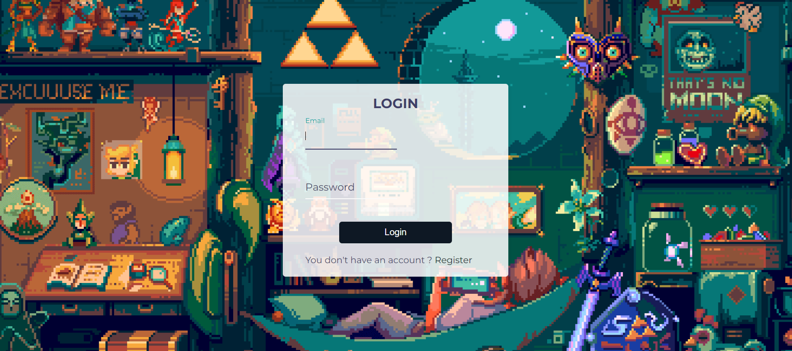
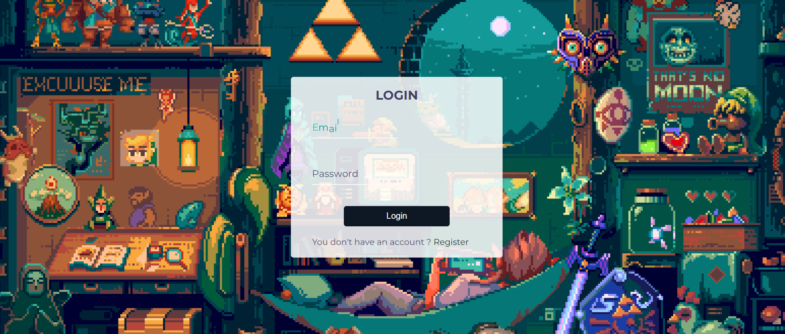

# :flower_playing_cards: Form Wave

Ce projet est un formulaire interactif avec un effet visuel inspiré des vagues de la Game Boy Color, utilisant des animations CSS et GSAP.

Il a été réalisé dans le cadre d'une formation sur [Udemy](https://www.udemy.com/course/50-projects-50-days/).

Ce formulaire comprend une page de **connexion** et une page **d'inscription**. Les labels des champs "Email" et "Password" montent de manière dynamique lorsque l'utilisateur clique sur ces champs. L'effet est accentué par une animation fluide des couleurs, faisant référence à l'univers de **Zelda** avec un clin d'œil à **Link** (couleur des labels).

## Fonctionnalités

- **Animation des Labels** : Chaque label est animées avec un léger décalage pour créer un effet visuel fluide lorsqu’un utilisateur clique dans un champ.
- **Responsive Design** : Le formulaire s’adapte aux différentes tailles d’écran grâce aux media queries.
- **Effet Glacé** : Un effet visuel subtil a été ajouté au formulaire pour le rendre transparent et en harmonie avec l'image de fond.

### Technologies Utilisées

GSAP : Bibliothèque d'animations utilisée pour créer des transitions fluides et dynamiques

#### Structure du projet

Ce projet est le huitième d'une série dans laquelle je me donne l'objectif de perfectionner mes compétences en JavaScript.

- **index.html :** Contient la structure de base de la page de connexion, avec le formulaire et les liens vers la page d'inscription.
- **register.html :** Structure la page d'inscription avec un formulaire similaire à celui de la page de connexion, permettant aux utilisateurs de s'inscrire.
- **style.css :** Gère le style global des pages, incluant les effets visuels des labels, le design responsive, ainsi que l'intégration de l'image de fond.
- **script.js :** Gère les animations des labels du formulaire avec GSAP, permettant de créer des transitions fluides lorsque les champs sont activés.
- **Chill-of-the-Wild.gif :** Image de fond utilisée pour créer une ambiance visuelle immersive et cohérente avec le style des formulaires. (copyright by pixeljeff)

